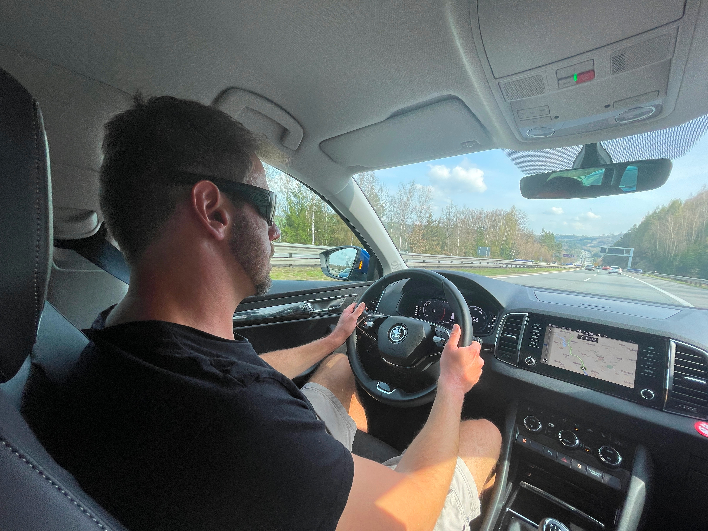
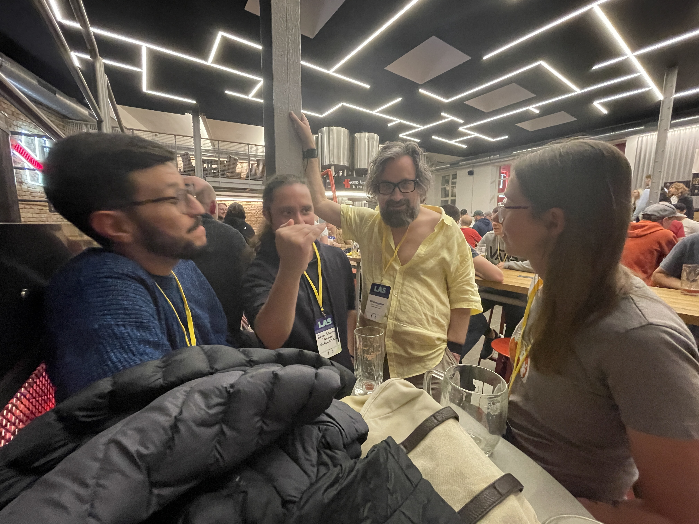
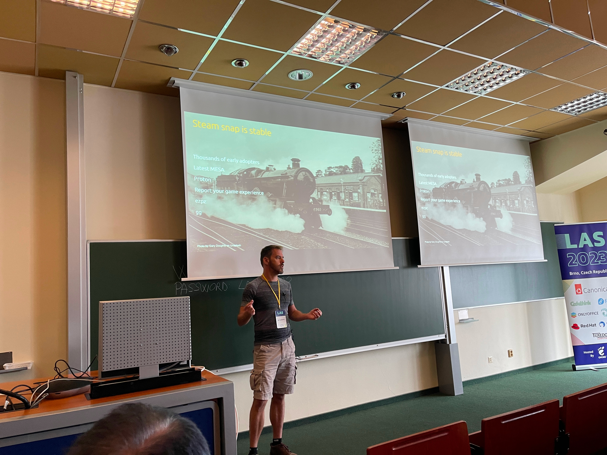
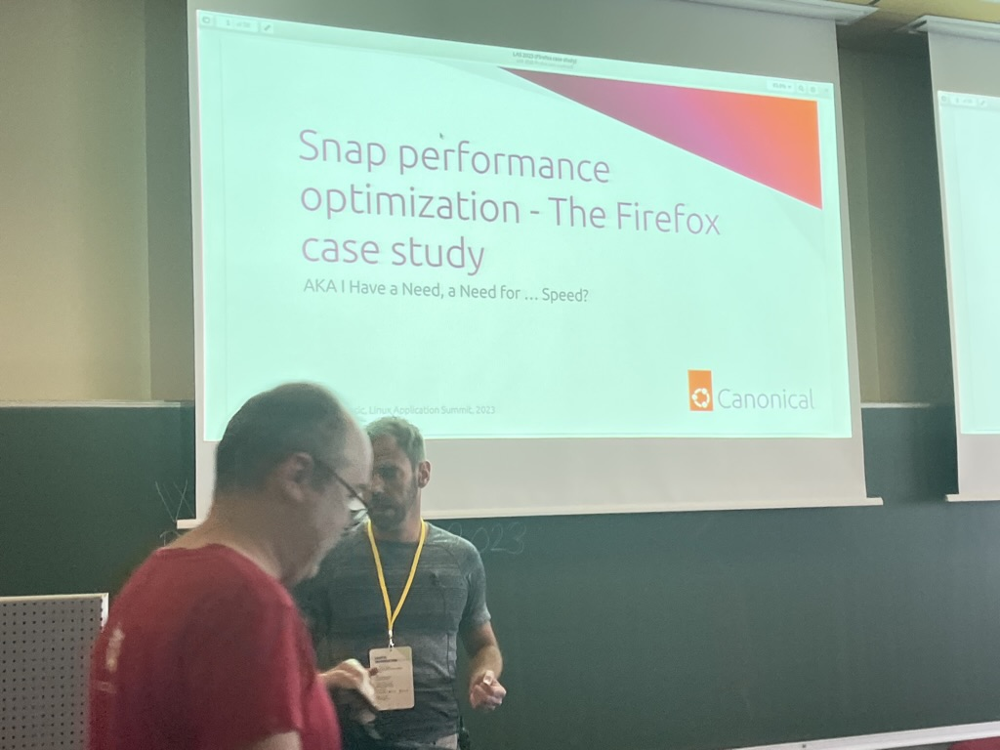
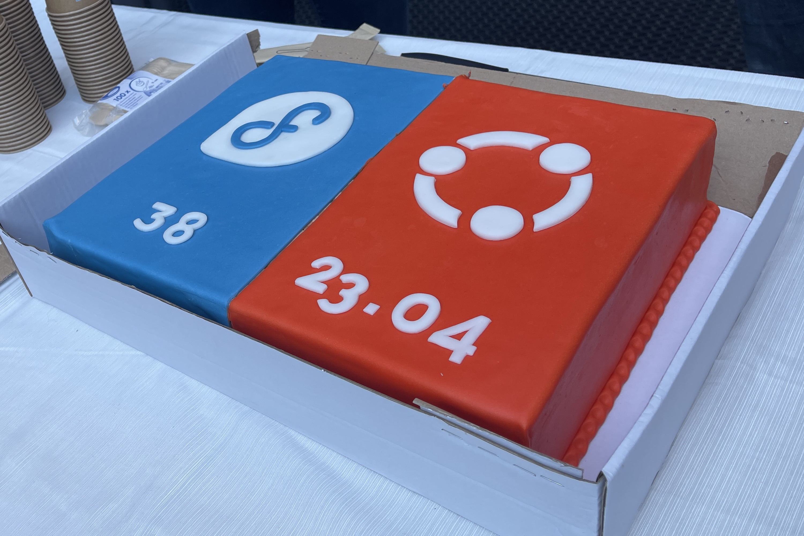
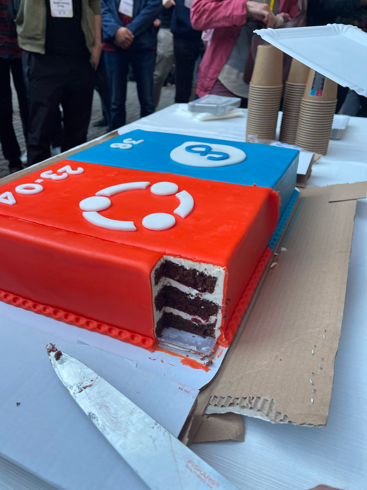
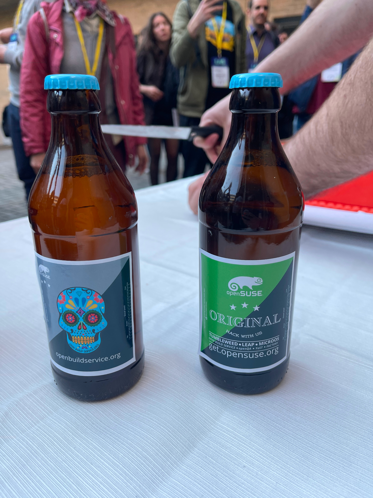
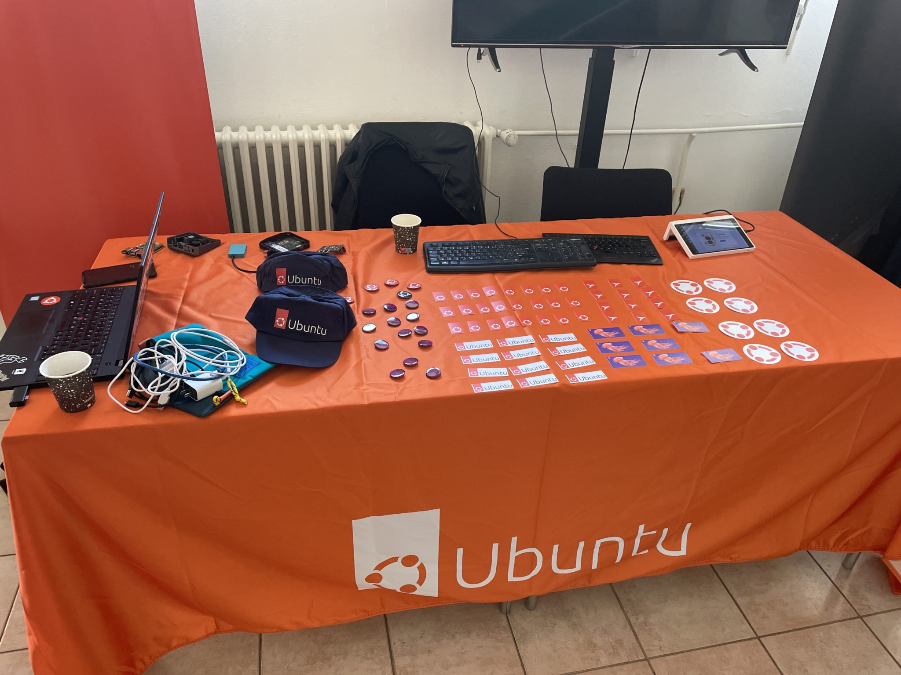
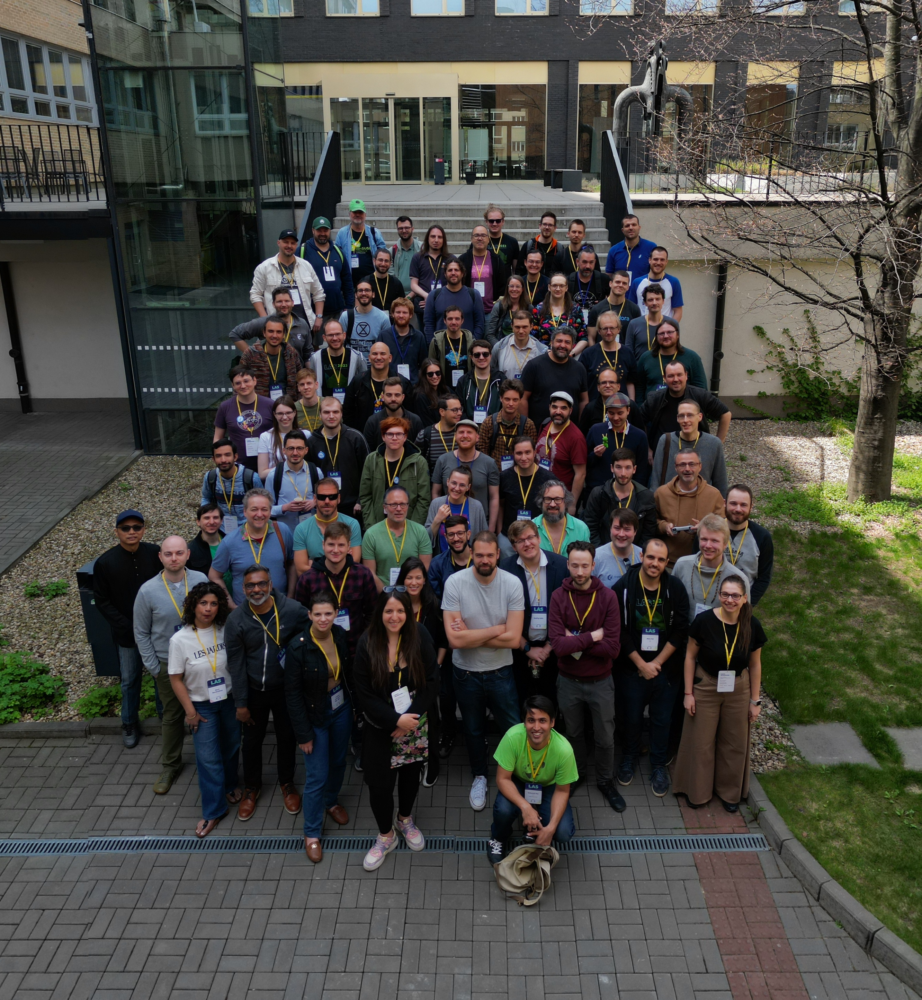

I was privileged to attent the Linux App Summit 2023, between April 21st and 23rd 2023, where I joined with Merlijn Sebrechts to co-present a shared talk about our work on Sommelier as part of the Snapcrafters Project. During the conference we got to meet and talk with a wide range of influential and knowledgeable people within the Linux desktop comunity with representatives from both KDE and Gnome present among many others. Lots of friends have been made, and old friends re-connected with.

## The day before...

My journey to Brno for the conference began on Friday with a train up to London and a flight into Prague. Thankfully I'd arranged to fly on the same place as a good friend who was also attending the conference on behalf of Canonical. They hired a car to get us from Prague to Brno. The drive was longer than the flight took 🤦🏻‍♀️ We had fun anyway as we also acquired a couple of other travel-mates, who were also attending the conference, while we were at Prague airport. Lots of chitchat ensured during the 3 hour drive, but we discovered that our travel companions have no taste in music or films 🤭 I mean, how can you say Top Fun isn't an amazing movie, and that 80s songs aren't top tier music?!

The conference itself was to be held on the weekend, so the day before included a pre-conference get-together party. At the party we got to network and chat about random things, both technical geekery and general discussion and getting to know each other. This helped us to break down any preconceptions or anxieties we may have about the people attending and the conference in general (especially helpful for me, with my imposter syndrome and social anxieties).

Events for the get-together in the were held in Harrys Bar, with lots of tasty local beers to try. I have no clue which ones I tasted, but they were all good and were recommended by others because I have no clue when it comes to beers (or any drinks really.)

## ... The event begins ...

During the first day we opened the conference with opening remarks for ten minutes including a couple of minutes for the main sponsors. Igor was up for Canonical and used a moment to tell us that Steam the gaming distribution platform by Valve is now marked as 'stable' in the Snap Store among other recent achievements by the Canonical team.

The talks ranged from governmental policy and lawmaking discussions such as the keynote [Regulatory state of play of Open Source in the EU](https://conf.linuxappsummit.org/event/5/sessions/6/), to interesting future directions including [UnifiedPush - Push notifications for Linux](https://conf.linuxappsummit.org/event/5/contributions/149/) and a panel discussion asking [What's next for the Linux App Ecosystem?](https://conf.linuxappsummit.org/event/5/contributions/151/)

My main focus on the first day was attending Igor's talk [Snap performance optimization - The Firefox case study](https://conf.linuxappsummit.org/event/5/contributions/152/) detailing how the team behind bringing Firefox to the Snap Store have brought startup and performance metrics for the snap to be on-par with firefox when installed natively (i.e. not in a snap or other package format such as Flatpak.) This talk also included helpful tips on how to analyse and optimise a snap that you make yourself.

Of course, while I say Igor's talk was my main focus, that was a bit of a lie because I was also presenting on the first day alongside Merlijn Sebrechts. Our talk, suggested by Merlijn, was [Bringing Windows applications to Linux app stores with Wine snaps](https://conf.linuxappsummit.org/event/5/contributions/156/). The recording was a bit wonky because we had microphone issues, but [the recording is available on YouTube](https://youtu.be/zBPndzvJgQo?t=3818). You can find [our slide deck on the Linux App Summit 2023 event page](https://conf.linuxappsummit.org/event/5/contributions/156/attachments/38/64/2023%20-%20Bringing%20Windows%20applications%20to%20Linux%20app%20stores%20with%20Wine%20snaps.pdf).

At the end of day one we all got together outside the venue for a combined Fedora and Ubuntu release party to celebrate their respective releases the previous week. We got to share some tasty cake that was branded with both projects' logos, and some local fizzy pop whose name I forget.

Not to be outdone at the release party, SuSE were handing out free as in beer merchandise to help keep us aware the Linux ecosystem is much more wide ranging beyomd Fedora and Ubuntu. The increassed awareness of SuSE doesn't go amiss either 🤭

## ... onto day two ...

I unfortunately missed the morning talks because I was so exhausted from the travelling and first day (this is a thing I have to live with at all times, not just during conferences.) I got to the venue after spending most of the morning trying to recover in time to have some coffee and sit behind the Ubuntu booth for a bit before lunch time came around.

Just before we all headed to lunch on day two there was enough time to take a conference group photo...

For the afternoon I spent some of the time sitting at the Ubuntu booth again, still trying to regather as much wherewithal as I could, and watching the lightning talks and closing remarks in the main track room. From my exhausted state I unfortunately dont remember a lot about the second days goings on.

After the closing remarks it was time for everyone to head their separate ways back home. I recall getting lots of hugs and compliments on Merlijn and my talk as we all drifted away for evening meals and travelling.

## ... and that was that. Another conference in the bag

Leaving the summit I am struck with how productive the collaboration was and is between the various projects, and with people's endorsements ringing in my ears about our talk. I like to think I've made some new friends who I want to meet up with in the future, and loved meeting up with old friends again. Conferences definitely help to ensure we all get to interact in person, occasionally, to reinforce our friendships and working relationships.

I want to extend a huge thank you to both the Canonical team at the summit for spending their time with me and ensuring that I felt welcomed and supported; and the Ubuntu Community Fund, and those who have donated to it, for providing the sponsorship to cover my travel and accomodation, without which I would have been unable to attend.

So that's it. I hope to bew back next year, but who knows maybe I'll make it to other conferences in the meantime...